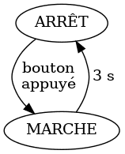

## Atelier Arduino – Programmation efficace

  
<small>Arduino Uno R3 – © Maker Media GmbH – CC BY-SA 4.0</small>

Edgar Bonet

CCSTI Grenoble – 2024-01-06

---

## Présentation


* Edgar Bonet
  * physicien, spécialisé dans le magnétisme
  * libriste de longue date
  * contributeur fréquent à [Arduino Stackexchange][ase]
  * [contributeur occasionnel][pr] à l'écosystème Arduino
* [Laboratoire Ouvert Grenoblois][log]
  * hackerspace grenoblois
  * partage de connaissances et savoir-faire
* [La Casemate][ccsti]
  * premier CCSTI créé en France
  * expositions, rencontres, ateliers, FabLab...

[ase]: https://arduino.stackexchange.com/
[pr]: https://github.com/pulls?q=author%3Aedgar-bonet+is%3Apr+is%3Amerged+org%3Aadafruit+org%3Aarduino+org%3Aarduino-libraries
[log]: https://www.logre.eu/
[ccsti]: https://lacasemate.fr/

Note: Faire tour de table pour se présenter.  
Dire : attentes, expérience en programmation Arduino, évènementielle,
machines à états.

---

## Programmation non bloquante – Motivation

But : gérer plusieurs tâches en parallèle, sans qu'elles se bloquent
mutuellement.

 Recherche « blocking
is:answer » → 1 217 résultats

> Many of the programming questions on the Arduino forum can be answered
> with one simple response: Implement a "Finite State Machine."
> — Majenko

Note: Les questions ne sont pas posées en termes de parallélisme.

--

### Stratégies pour gérer des tâches parallèles

1. Un processus/thread par tâche
  * optimal pour tâches lourdes sur un processeur multi-cœur
  * nécessite un OS (ordonnanceur)
  * coût en mémoire (une pile par thread)
2. Gérer des évènements successif dans un thread unique
  * optimal quand la gestion d'un évènement est légère
  * faible coût en mémoire et CPU
  * approche populaire pour le Web (Nginx, Node.js...)

Note: On demande à un Arduino des tâches simples (< 1 ms).  
Il passe le plus clair de son temps à attendre.

---

## Faire clignoter des LED

Une seule LED (File/Examples/01.Basics/Blink) :

```arduino
const int led_pin = 8;

void setup() {
    pinMode(led_pin, OUTPUT);
}

void loop() {
    digitalWrite(led_pin, HIGH);
    delay(400);
    digitalWrite(led_pin, LOW);
    delay(400);
}
```

Exercices :
* Charger et exécuter ce programme
* Faire clignoter deux LED : une en triolets et une en temps binaire.

Note: demander solution bloquante (algo seul)

--

### Clignotement non bloquant

Fichier → Exemples → 02.Digital → BlinkWithoutDelay

```arduino
const int led_pin = 8;
int led_state = LOW;
unsigned long last_change = 0;  // quand a-t-on changé d'état pour la dernière fois ?

void setup() {
  pinMode(led_pin, OUTPUT);
}

void loop() {
  unsigned long now = millis();  // l'heure actuelle

  if (now - last_change >= 400) {  // il est temps de changer d'état
    last_change += 400;

    if (led_state == LOW) {  // calculer le nouvel état
      led_state = HIGH;
    } else {
      led_state = LOW;
    }

    digitalWrite(led_pin, led_state);  // appliquer cet état
  }
}
```

Note: pour deux LED, dupliquer les variables globales.

--

### Principe général d'un programme non-bloquant

```arduino
void loop() {
    if (évènement_machin_est_arrivé) {
        gérer_évènement_machin();
    }

    if (évènement_bidule_est_arrivé) {
        gérer_évènement_bidule();
    }

    if (évènement_truc_est_arrivé) {
        gérer_évènement_truc();
    }

    // etc.
}
```

Note: Ne **jamais** s'arrêter à attendre

---

## Lire un bouton poussoir

But : quand on appuie sur un bouton, le moteur tourne trois secondes.

```arduino
void loop() {
    // Attendre la pression sur le bouton.
    while (digitalRead(button_pin) == LOW)
        ;

    // Allumer le moteur pendant trois secondes.
    digitalWrite(motor_pin, HIGH);
    delay(3000);
    digitalWrite(motor_pin, LOW);
}
```

Exercice : Implémenter cette fonctionnalité tout en faisant clignoter la
LED.

Note: La LED « heartbeat » témoigne que le programme ne s'est pas
bloqué.

--

### Notion d'automate fini

<div style="float: right">

</div>

Le programme précédent peut s'interpréter comme un « automate fini » à
deux états :

* dans chaque état on attend un évènement
* les évènements déclenchent des transitions
* les actions de l'automate sont associées aux transitions

Note: Différence avec organigramme (flowchart).

---

## Automates finis

<div style="float: right">

</div>

Ma montre

d'après le mode d'emploi

--

La même montre,  
d'après mes essais.


Note: Les ingénieurs qui l'ont conçue on probablement dessiné un schéma
semblable à celui-ci.

---

## Exercice : feu tricolore


Note: Comment ajouter un bouton d'appel piétons ?

--


Note: Problème : et si un gamin facétieux appuie sur le bouton à chaque
fois que le feu passe au vert ?

--


Note: Problème : si un piéton appelle dans l'état VERT, l'appel n'est
pas pris en compte.

--


