## Atelier Arduino

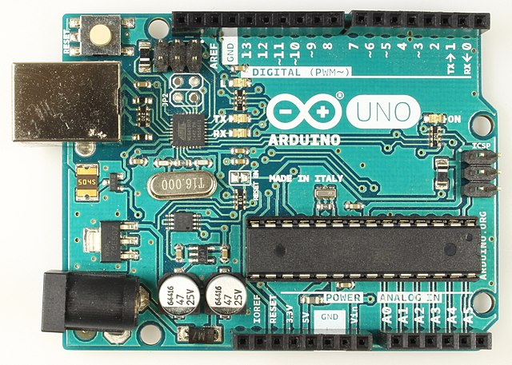  
<small>Arduino Uno R3 – © Maker Media GmbH – CC BY-SA 4.0</small>

Edgar Bonet

CCSTI Grenoble – 2022-11-03

---

## Présentation


* Edgar Bonet
  * physicien, spécialisé dans le magnétisme
  * libriste de longue date
  * contributeur majeur à [Arduino Stackexchange][ase]
  * [contributeur occasionnel][pr] à l'écosystème Arduino
* [Laboratoire Ouvert Grenoblois][log]
  * hackerspace grenoblois
  * partage de connaissances et savoir-faire
* [La Casemate][ccsti]
  * premier CCSTI créé en France
  * expositions, rencontres, ateliers, FabLab...

[ase]: https://arduino.stackexchange.com/
[pr]: https://github.com/pulls?q=author%3Aedgar-bonet+is%3Apr+is%3Amerged+org%3Aadafruit+org%3Aarduino+org%3Aarduino-libraries
[log]: https://www.logre.eu/
[ccsti]: https://lacasemate.fr/

Note: Faire tour de table pour se présenter.
Dire : attentes, expérience en électronique, programmation, C/C++

---

## Arduino : Matériel

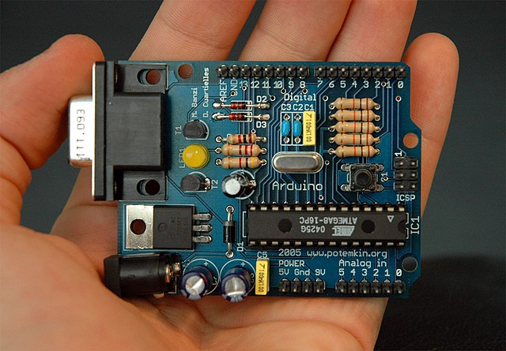  
<small>Arduino Serial (2005) – © Nicholas Zambetti – CC BY-SA 3.0</small>

* depuis 2005 : cartes classiques AVR, 8 bits
* cartes plus puissantes à architecture ARM 32 bits
* clones et contrefaçons
* cartes tierces plus ou moins compatibles

--

### Utilisations

Une carte Arduino peut être :
* intégrée définitivement à un projet
* servir uniquement de plateforme de prototypage ([exemple][])

[exemple]: https://www.phi.kit.edu/jobs_1452.php

Note: Il y a des petites cartes adaptées à l'intégration sur PCB.

---

## Arduino : Logiciel

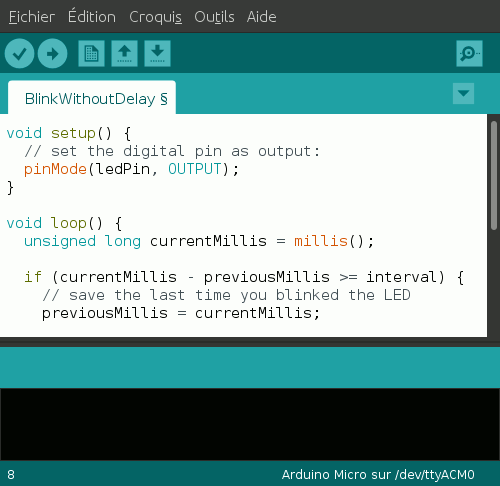
* côté hôte : outils de développement
  * IDE (versions 1.8 et 2.0)
  * arduino-cli

* côté cible : bibliothèques
  * Arduino core
  * bibliothèques Arduino
  * bibliothèques tierces

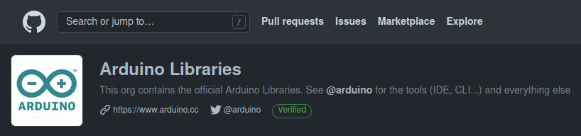

Note: Aussi : Arduino Web Editor

---

## Arduino : Communauté

* partage (blogs, instructables)  
  
  
  
  
  
  ...

* entre-aide (forum, stackexchange)  
  
  
  ...

* IRL  
  
  ...

---

## Téléchargement de l'IDE

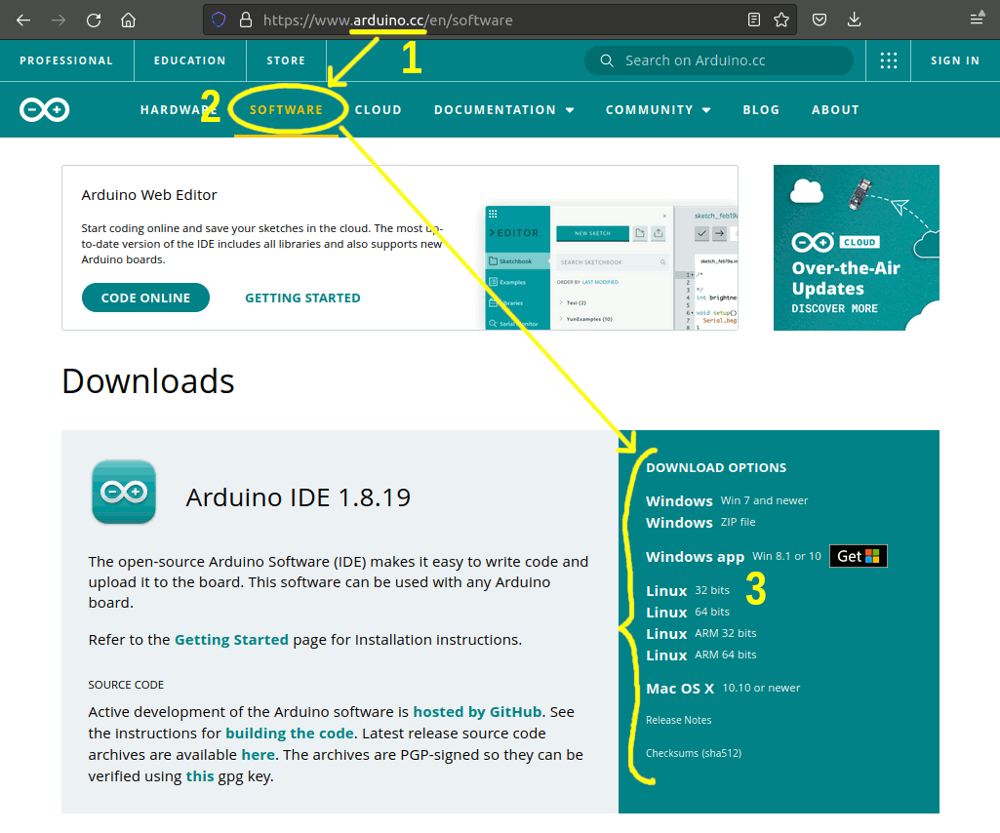

---

## Prise en main de l'IDE

* configurer :  
  Fichier → Préférences → Avertissement du compilateur :
  « Plus » ou « Tout »  
  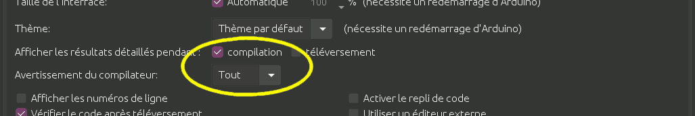

* charger un programme :  
  Fichier → Exemples → 01.Basics → Blink

* téléverser :  
  Bouton
  

---

## Faire clignoter la LED

**Exemple fourni**:

```arduino
void setup() {
  pinMode(LED_BUILTIN, OUTPUT);     // configurer la broche 13 en sortie
}

void loop() {
  digitalWrite(LED_BUILTIN, HIGH);  // allumer
  delay(1000);                      // attendre
  digitalWrite(LED_BUILTIN, LOW);   // éteindre
  delay(1000);                      // attendre
}
```

**Exercice** : modifier le rythme :
deux flashs, courte pause, deux flashs, courte pause...

Note: Expliquer la syntaxe.

rythme : noire, noire, demi-pause (blanche)

---

## Bases de C++

Voir pense-bête.

* langage complexe, on se limite à un sous-ensemble simple
* syntaxe très stricte
* l'indentation aide à voir la structure du code

Note: Inventer de la syntaxe ne marche pas.

Ctrl-T pour indenter.

---

## Schéma générique d'un projet Arduino

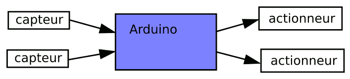

* des organes d'entrée (capteurs)
* un Arduino pour faire le traitement des données
* des organes de sortie (actionneurs)

--

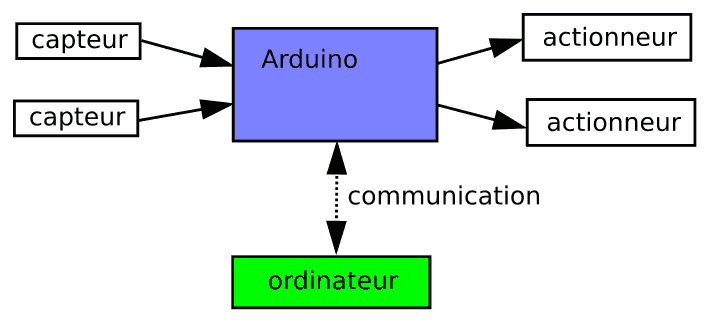

* optionnellement, communication avec un ordinateur

---

## Bases d'électronique

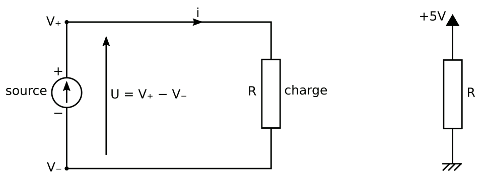

U = R i  
i = U / R

Note: Analogie hydraulique :
* source, résistance
* i, V, U

--

### Pont diviseur de tension

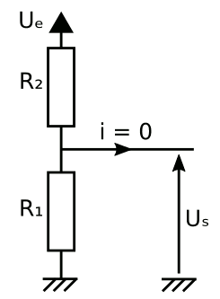

Uₛ = R₁/(R₁+R₂) × Uₑ

Note: voir cas dégénérés
* R₂ = 0 ou ∞
* R₁ = 0 ou ∞
* (R₁ et R₂) = 0 ou ∞

--

### Entrées de l'Arduino

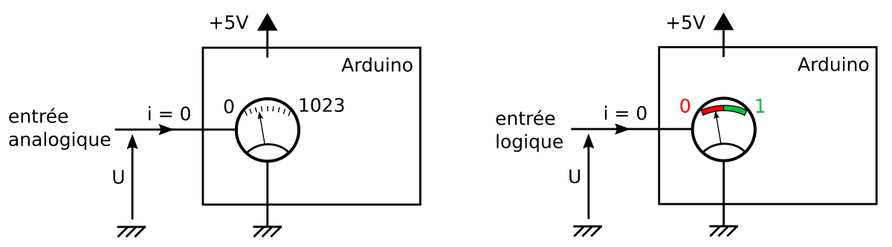

```arduino
// Dans setup() :
pinMode(numero_de_broche, INPUT);

int valeur_analogique = analogRead(numero_de_broche);
float U = valeur_analogique / 1024.0 * 5.0;  // en volts

int valeur_logique = digitalRead(numero_de_broche);
```

--

### Sorties de l'Arduino

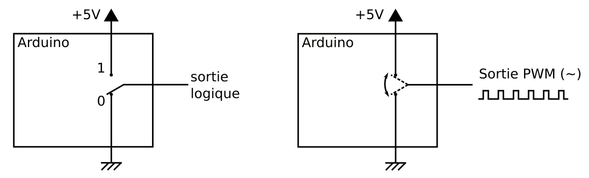

```arduino
// Dans setup() :
pinMode(numero_de_broche, OUTPUT);

digitalWrite(numero_de_broche, LOW);   // LOW = 0
digitalWrite(numero_de_broche, HIGH);  // LOW = 1

analogWrite(numero_de_broche, valeur);  // valeur = 0 à 255
```

---

## Recettes

### Capteur résistif

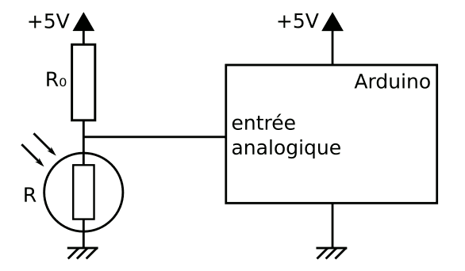

Tension mesurée : U = R/(R+R₀) × (5 V)

```arduino
int lecture = analogRead(numero_de_broche);
float R = lecture / (1024.0 - lecture) * R0;
```

Note: i = 0  
Si on inverse R et R₀:  
R = (1024.0 - lecture) / lecture * R0

--

### Potentiomètre

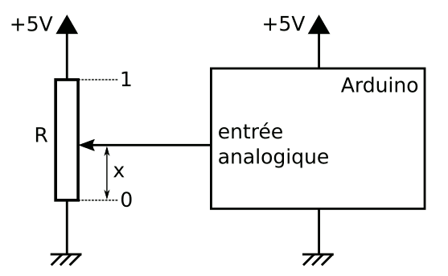

Tension mesurée : U = x ⋅ (5 V)

```arduino
float x = analogRead(numero_de_broche) / 1024.0;  // entre 0 et 1
```

--

bouton (avec ou sans debounce)

LED (avec ou sans PWM)

sortie fort courant (transistor)

charge inductive (transistor + diode roue libre)

moteur (PWM)

---

## Exercices

1 entrée et 1 sortie

---

## Programmation non bloquante

---

## Blink without Delay

Fichier → Exemples → 02.Digital → BlinkWithoutDelay

```arduino
int etat_LED = LOW;

unsigned long temps_dernier_changement = 0;  // quand a-t-on changé d'état pour la dernière fois ?

void setup() {
  pinMode(13, OUTPUT);
}

void loop() {
  unsigned long maintenant = millis();  // l'heure actuelle

  if (maintenant - temps_dernier_changement >= 400) {  // il est temps de changer d'état
    temps_dernier_changement = maintenant;

    if (etat_LED == LOW) {  // calculer le nouvel état
      etat_LED = HIGH;
    } else {
      etat_LED = LOW;
    }

    digitalWrite(13, etat_LED);  // appliquer cet état
  }
}
```

---

## Automates finis

<div style="float: right">
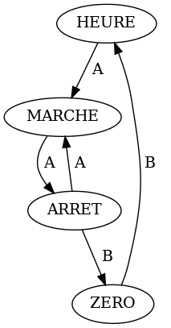
</div>

Ma montre

d'après le mode d'emploi

--

La même montre,  
d'après mes essais.

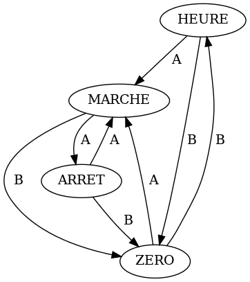

Note: Les ingénieurs qui l'ont conçue on probablement dessiné un schéma
semblable à celui-ci.

---

## Exercice : feu tricolore

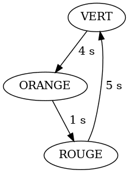

Note: Comment ajouter un bouton d'appel piétons ?

--

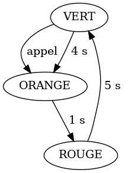

Note: Problème : et si un gamin facétieux appuie sur le bouton à chaque
fois que le feu passe au vert ?

--

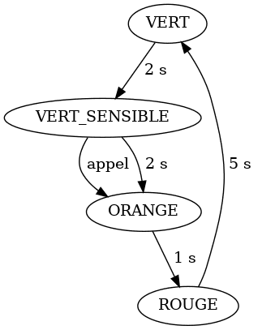

Note: Problème : si un piéton appelle dans l'état VERT, l'appel n'est
pas pris en compte.

--

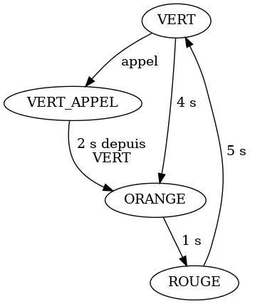
