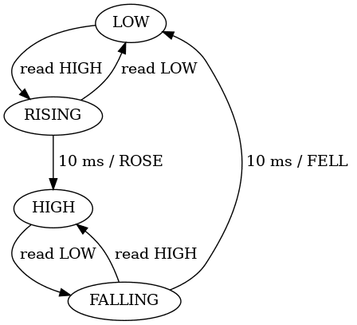

## Atelier Arduino – Programmation efficace

  
<small>Arduino Uno R3 – © Maker Media GmbH – CC BY-SA 4.0</small>

Edgar Bonet

CCSTI Grenoble – 2024-01-06

---

## Présentation


* Edgar Bonet
  * physicien, spécialisé dans le magnétisme
  * libriste de longue date
  * contributeur fréquent à [Arduino Stackexchange][ase]
  * [contributeur occasionnel][pr] à l'écosystème Arduino
* [Laboratoire Ouvert Grenoblois][log]
  * hackerspace grenoblois
  * partage de connaissances et savoir-faire
* [La Casemate][ccsti]
  * premier CCSTI créé en France
  * expositions, rencontres, ateliers, FabLab...

[ase]: https://arduino.stackexchange.com/
[pr]: https://github.com/pulls?q=author%3Aedgar-bonet+is%3Apr+is%3Amerged+org%3Aadafruit+org%3Aarduino+org%3Aarduino-libraries
[log]: https://www.logre.eu/
[ccsti]: https://lacasemate.fr/

Note: Faire tour de table pour se présenter.  
Dire : attentes, expérience en programmation Arduino, évènementielle,
machines à états.

---

## Programmation non bloquante – Motivation

But : gérer plusieurs tâches en parallèle, sans qu'elles se bloquent
mutuellement.

 Recherche « blocking
is:answer » → 1 217 résultats

> Many of the programming questions on the Arduino forum can be answered
> with one simple response: Implement a "Finite State Machine."
> — Majenko

Note: Les questions ne sont pas posées en termes de parallélisme.

--

### Stratégies pour gérer des tâches parallèles

1. Un processus/thread par tâche
  * optimal pour tâches lourdes sur un processeur multi-cœur
  * nécessite un OS (ordonnanceur)
  * coût en mémoire (une pile par thread)
2. Gérer des évènements successif dans un thread unique
  * optimal quand la gestion d'un évènement est légère
  * faible coût en mémoire et CPU
  * approche populaire pour le Web (Nginx, Node.js...)

Note: On demande à un Arduino des tâches simples (< 1 ms).  
Il passe le plus clair de son temps à attendre.

---

## Faire clignoter des LED

Une seule LED (File/Examples/01.Basics/Blink) :

```arduino
const int led_pin = 8;

void setup() {
    pinMode(led_pin, OUTPUT);
}

void loop() {
    digitalWrite(led_pin, HIGH);
    delay(400);
    digitalWrite(led_pin, LOW);
    delay(400);
}
```

Exercices :
* Charger et exécuter ce programme
* Faire clignoter deux LED : une en triolets et une en temps binaire.

Note: demander solution bloquante (algo seul)

--

### Clignotement non bloquant

Fichier → Exemples → 02.Digital → BlinkWithoutDelay

```arduino
const int led_pin = 8;
int led_state = LOW;
unsigned long last_change = 0;  // quand a-t-on changé d'état pour la dernière fois ?

void setup() {
  pinMode(led_pin, OUTPUT);
}

void loop() {
  unsigned long now = millis();  // l'heure actuelle

  if (now - last_change >= 400) {  // il est temps de changer d'état
    last_change += 400;
    if (led_state == LOW) {  // calculer le nouvel état
      led_state = HIGH;
    } else {
      led_state = LOW;
    }
    digitalWrite(led_pin, led_state);  // appliquer cet état
  }
}
```

Note: pour deux LED, dupliquer les variables globales.

--

### Principe général d'un programme non-bloquant

```arduino
void loop() {
    if (évènement_machin_est_arrivé) {
        gérer_évènement_machin();
    }

    if (évènement_bidule_est_arrivé) {
        gérer_évènement_bidule();
    }

    if (évènement_truc_est_arrivé) {
        gérer_évènement_truc();
    }

    // etc.
}
```

Note: Ne **jamais** s'arrêter à attendre

---

## Lire un bouton poussoir

But : quand on appuie sur un bouton, le moteur tourne trois secondes.

```arduino
void loop() {
    // Attendre la pression sur le bouton.
    while (digitalRead(button_pin) == LOW)
        ;

    // Allumer le moteur pendant trois secondes.
    digitalWrite(motor_pin, HIGH);
    delay(3000);
    digitalWrite(motor_pin, LOW);
}
```

Exercice : Implémenter cette fonctionnalité tout en faisant clignoter la
LED.

Note: La LED « heartbeat » témoigne que le programme ne s'est pas
bloqué.

--

### Solution non-bloquante

```arduino
void loop() {
    static bool motor_is_running = false;
    if (!motor_is_running && digitalRead(button_pin == HIGH)) {
        digitalWrite(motor_pin, HIGH);
        motor_is_running = true;
        time_turned_on = millis();
    }
    if (motor_is_running && millis() - time_turned_on >= 3000) {
        digitalWrite(motor_pin, LOW);
        motor_is_running = false;
    }
}
```

Note: L'évènement qu'on attend, et la réponse, dépendent de l'état du
système.

--

### Notion d'automate fini

<div style="float: right">

</div>

Le programme précédent peut s'interpréter comme un « automate fini » à
deux états :

* dans chaque état on attend un évènement
* les évènements déclenchent des transitions
* les actions de l'automate sont associées aux transitions

Note: Différence avec organigramme (flowchart).

---

## Automates finis

<div style="float: right">

</div>

Ma montre

d'après le mode d'emploi

Note: Un état peut attendre plusieurs évènements : le premier arrivé
déclenche la transition.

--

La même montre,  
d'après mes essais.


Note: Les ingénieurs qui l'ont conçue on probablement dessiné un schéma
semblable à celui-ci.

---

## Exercice : feu tricolore


```arduino
void loop() {
    digitalWrite(green_pin, LOW);
    digitalWrite(orange_pin, HIGH);
    delay(1000);

    digitalWrite(orange_pin, LOW);
    digitalWrite(red_pin, HIGH);
    delay(5000);

    digitalWrite(red_pin, LOW);
    digitalWrite(green_pin, HIGH);
    delay(4000);
}
```

--

### Solution non-bloquante

```arduino
void loop() {
    static enum { GREEN, ORANGE, RED } state = GREEN;  // préparé dans setup()
    static uint32_t last_change = 0;
    uint32_t now = millis();

    switch (state) {
        case GREEN:
            if (now - last_change >= 4000) {
                digitalWrite(green_pin, LOW);
                digitalWrite(orange_pin, HIGH);
                state = ORANGE;
                last_change = now;
            }
            break;
        case ORANGE:
            if (now - last_change >= 1000) {
                digitalWrite(orange_pin, LOW);
                digitalWrite(red_pin, HIGH);
                state = RED;
                last_change = now;
            }
            break;
        case RED:
            if (now - last_change >= 5000) {
                digitalWrite(red_pin, LOW);
                digitalWrite(green_pin, HIGH);
                state = GREEN;
                last_change = now;
            }
            break;
    }
}
```

Recette pour convertir un code bloquant en automate fini :

* repérer les endroits où le code est en attente d'un évènement
* faire de chaque attente un état

Note: Structure switch/case utilisable pour toute automate fini.  
Comment ajouter un bouton d'appel piétons ?

--

### Avec bouton d'appel piétons


Note: Problème : et si un gamin facétieux appuie sur le bouton à chaque
fois que le feu passe au vert ?

--

### Avec temps minimum au vert


Note: Problème : si un piéton appelle dans l'état VERT, l'appel n'est
pas pris en compte.

--

### Avec bouton d'appel toujours sensible


Note: La transition VERT\_APPEL → ORANGE peut être instantanée  
Le diagramme d'état sert à affiner le cahier des charges.

---

## Servo qui scanne


```arduino
#include <Servo.h>

Servo myservo; 

void setup() {
    myservo.attach(4);
}

void loop() {
    for (int i = 2; i <= 180; i += 2) {
        myservo.write(i);
        delay(20);
    }
    for (int i = 178; i >= 0; i -= 2) {
        myservo.write(i);
        delay(20);
    }
}
```

Note: Il y a 180 états.

---

## Moteur de portail

<div style="float: right">

</div>

Programmer cet automate.

Note: Et si on appuie sur le bouton quand le portail est en mouvement ?

---

## Debounce

Commuter une LED par appui sur un bouton.

Exemple de code problématique :

```arduino
void loop() {
    static int led_state = LOW;
    static int old_button_state = LOW;
    int button_state = digitalRead(button_pin);

    // Détection de l'appui sur le bouton.
    if (old_button_state == LOW && button_state == HIGH) {
        led_state = led_state==HIGH ? LOW : HIGH;
        digitamWrite(led_pin, led_state);
    }
    old_button_state = button_state;
}
```

--

## Solution par machine à états



--

## Solution avec une bibliothèque

```arduino
#include <Bounce2.h>

const int button_pin = 2;
const int led_pin = 8;

Bounce button;

void setup() {
    button.attach(button_pin, INPUT);
    pinMode(led_pin, OUTPUT);
}

void loop() {
    static int led_state = LOW;

    button.update();
    if (button.rose()) {
        led_state = led_state==HIGH ? LOW : HIGH;
        digitamWrite(led_pin, led_state);
    }
}
```

---

## Lire un port série

Lecture bloquante :

```arduino
void loop() {
    // Attendre des données sur le port série.
    while (Serial.available() == 0)
        ;

    // Lire une commande et l'exécuter.
    String command = Serial.readString();
    interpret(command);
}
```

Note: readString() est aussi bloquant → timeout.

--

### Solution non-bloquante

```arduino
void loop() {
    static char buffer[80];
    static size_t buffer_pos = 0;

    if (Serial.available()) {
        char c = Serial.read();
        if (c == '\n') {
            buffer[buffer_pos] = '\n';  // terminer la chaîne
            interpret(buffer);
            buffer_pos = 0;  // préparer la prochaine lecture
        } else if (buffer_pos < sizeof buffer - 1) {
            buffer[buffer_pos++] = c;
        }
    }
}
```

Voir aussi:
* [Reading Serial on the Arduino][majenko], par Majenko
* [Simple Arduino command line interpreter][gist], par Edgar

[majenko]: https://majenko.co.uk/blog/reading-serial-arduino
[gist]: https://gist.github.com/edgar-bonet/607b387260388be77e96

Note: On profite pour éviter String.
