## Atelier Arduino

  
<small>Arduino Uno R3 – © Maker Media GmbH – CC BY-SA 4.0</small>

Edgar Bonet

CCSTI Grenoble – 2024-09-28

---

## Présentation


* Edgar Bonet
  * physicien, spécialisé dans le magnétisme
  * libriste de longue date
  * contributeur fréquent à [Arduino Stackexchange][ase]
  * [contributeur occasionnel][pr] à l'écosystème Arduino
* [Laboratoire Ouvert Grenoblois][log]
  * hackerspace grenoblois
  * partage de connaissances et savoir-faire
* [La Casemate][ccsti]
  * premier CCSTI créé en France
  * expositions, rencontres, ateliers, FabLab...

[ase]: https://arduino.stackexchange.com/
[pr]: https://github.com/pulls?q=author%3Aedgar-bonet+is%3Apr+is%3Amerged+org%3Aadafruit+org%3Aarduino+org%3Aarduino-libraries
[log]: https://www.logre.eu/
[ccsti]: https://lacasemate.fr/

Note: Faire tour de table pour se présenter.
Dire : attentes, expérience en électronique, programmation, C/C++

---

## Arduino : Matériel

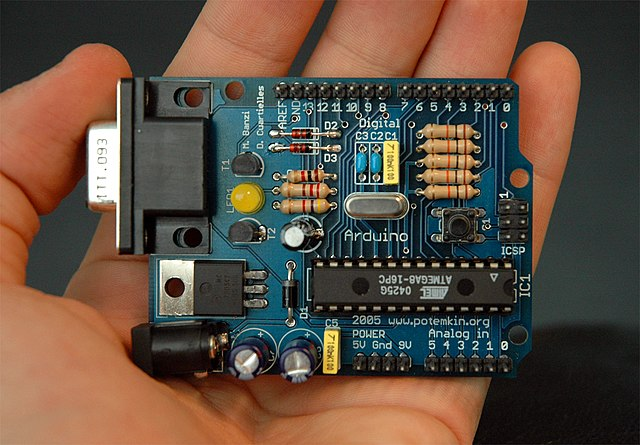  
<small>Arduino Serial (2005) – © Nicholas Zambetti – CC BY-SA 3.0</small>

* depuis 2005 : cartes classiques AVR, 8 bits
* cartes plus puissantes à architecture ARM 32 bits
* clones et contrefaçons
* cartes tierces plus ou moins compatibles

Note: Open Source Hardware.

--

### Utilisations

Une carte Arduino peut être :
* intégrée définitivement à un projet
* servir uniquement de plateforme de prototypage ([exemple][])

[exemple]: https://neel.cnrs.fr/wp-content/uploads/2020/11/Faits-marquants-2018.pdf#page=21

Note: Il y a des petites cartes adaptées à l'intégration sur PCB.

---

## Arduino : Logiciel


* côté hôte : outils de développement
  * IDE (versions 1.8 et 2.0)
  * arduino-cli

* côté cible : bibliothèques
  * Arduino core
  * bibliothèques Arduino
  * bibliothèques tierces


Note: Aussi : Arduino Web Editor

Open Source Software.

---

## Arduino : Communauté

* partage (blogs, instructables)  
  
  
  
  
  
  ...

* entre-aide (forum, stackexchange)  
  
  
  ...

* IRL  
  
  ...

---

## Téléchargement de l'IDE

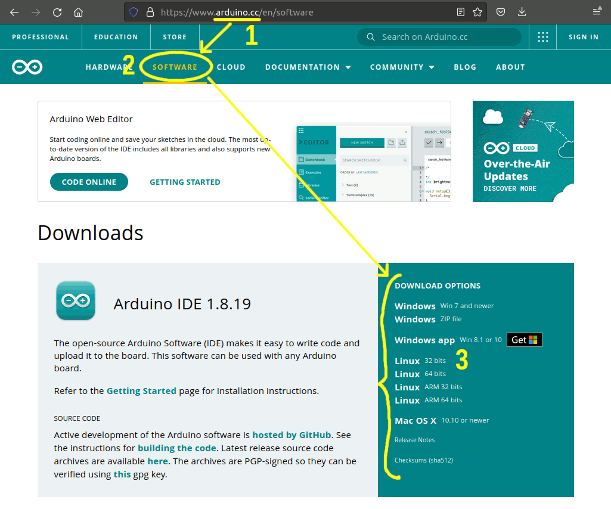

---

## Prise en main de l'IDE

* configurer :  
  Fichier → Préférences → Avertissement du compilateur :
  « Plus » ou « Tout »  
  

* charger un programme :  
  Fichier → Exemples → 01.Basics → Blink

* téléverser :  
  Bouton
  

---

## Faire clignoter la LED

**Exemple fourni**:

```arduino
void setup() {
    pinMode(LED_BUILTIN, OUTPUT);     // configurer la broche 13 en sortie
}

void loop() {
    digitalWrite(LED_BUILTIN, HIGH);  // allumer
    delay(1000);                      // attendre
    digitalWrite(LED_BUILTIN, LOW);   // éteindre
    delay(1000);                      // attendre
}
```

Note: Expliquer le code.

**Exercices**:
* changer les commentaires et les durées
* rythme : noire, noire, demi-pause (blanche)

---

## Bases de C++

Voir pense-bête.

* langage complexe, on se limite à un sous-ensemble simple
* syntaxe très stricte
* l'indentation aide à voir la structure du code

Référence du langage et des bibliothèques standard :
https://www.arduino.cc/reference/en/

Note: Sensible à la case.

Inventer de la syntaxe ne marche pas.

Ctrl-T pour indenter.

---

## Schéma générique d'un projet Arduino


* des organes d'entrée (capteurs)
* un Arduino pour faire le traitement des données
* des organes de sortie (actionneurs)

--

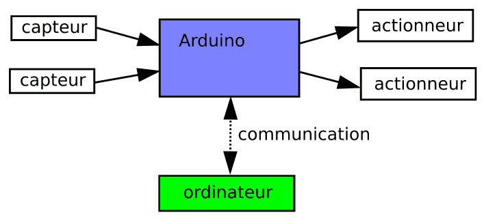

* optionnellement, communication avec un ordinateur

```arduino
void setup() {
    Serial.begin(9600);
}

void loop() {
    Serial.print("Le résultat est : ");
    Serial.println(42);
    delay(1000);
}
```

---

## Bases d'électronique

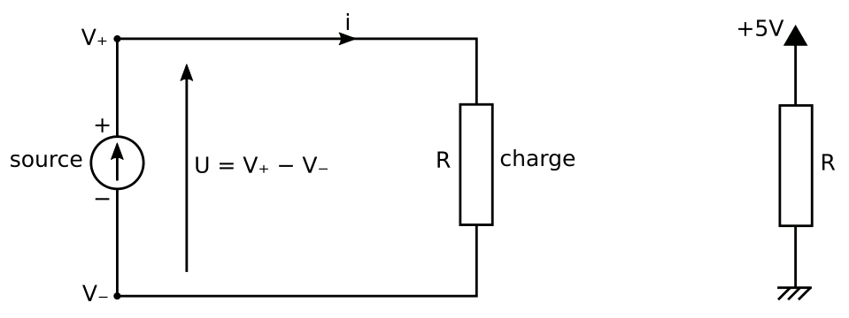

U = R i  
i = U / R

Note: Analogie hydraulique :
* source, résistance
* i, V (référence arbitraire), U

Fils équipotentiels (R ≈ 0).

--

### Pont diviseur de tension

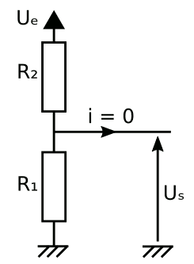

Uₛ = R₁/(R₁+R₂) × Uₑ

Note: voir cas dégénérés
* R₂ = 0 ou ∞
* R₁ = 0 ou ∞
* (R₁ et R₂) = 0 ou ∞

--

### Entrées de l'Arduino


```arduino
const int broche_analogique = A0;

void setup() {
    Serial.begin(9600);
}

void loop() {
    int valeur_analogique = analogRead(broche_analogique);
    float U = valeur_analogique / 1024.0 * 5.0;  // en volts
    Serial.print("tension mesurée : ");
    Serial.println(U);
    delay(1000);
}

/**********************************************************************/

const int broche_logique = 6;

void setup() {
    Serial.begin(9600);
    pinMode(broche_logique, INPUT);
}

void loop() {
    int valeur_logique = digitalRead(broche_logique);
    Serial.print("entrée logique : ");
    Serial.println(valeur_logique);
    delay(1000);
}
```

Note: Importance du « .0 ».

Limites en tension.

--

### Sorties de l'Arduino


```arduino
const int numero_de_broche = 6;

void setup() {
    pinMode(numero_de_broche, OUTPUT);
}

void loop() {
    digitalWrite(numero_de_broche, LOW);   // LOW = 0
    delay(1000);
    digitalWrite(numero_de_broche, HIGH);  // LOW = 1
    delay(1000);
    analogWrite(numero_de_broche, 123);  // valeur = 0 à 255
    delay(1000);
}
```

Note: Limites en courant.

---

## Recettes

### Capteur résistif

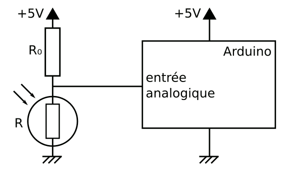

Tension mesurée : U = R/(R+R₀) × (5 V)

```arduino
const int numero_de_broche = A0;
const float R0 = 1000.0;

void setup() {
    Serial.begin(9600);
}

void loop() {
    int lecture = analogRead(numero_de_broche);
    float R = lecture / (1024.0 - lecture) * R0;
    Serial.print("résistance : ");
    Serial.println(R);
    delay(1000);
}
```

Note: i = 0

Si on inverse R et R₀:  
R = (1024.0 - lecture) / lecture * R0

Choix de R₀.

--

### Potentiomètre

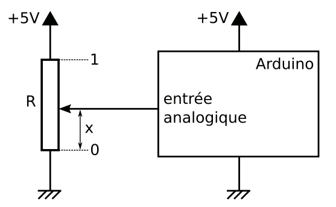

Tension mesurée : U = x ⋅ (5 V)

```arduino
const int numero_de_broche = A0;

void setup() {
    Serial.begin(9600);
}

void loop() {
    float x = analogRead(numero_de_broche) / 1024.0;  // entre 0 et 1
    Serial.print("position du potentiomètre : ");
    Serial.println(x);
    delay(1000);
}
```

--

### Bouton

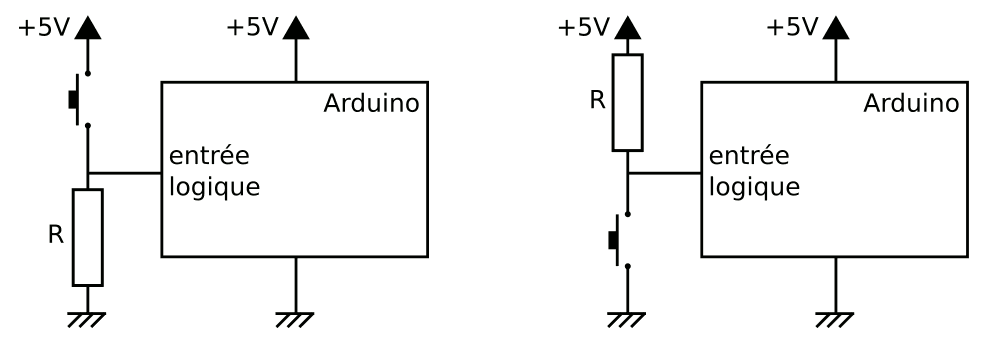

```arduino
const int numero_de_broche = 4;

void setup() {
    Serial.begin(9600);
    pinMode(numero_de_broche, INPUT);
}

void loop() {
    if (digitalRead(numero_de_broche) == HIGH) {  // LOW avec un pull-up
        Serial.println("Le bouton est pressé");
    } else {
        Serial.println("Le bouton est relâché");
    }
    delay(1000);
}
```

Note: Choix de R.

Noms : pull-up, pull-down.

Dans le kit : pull-down.

Debounce.

--

### Bouton avec pull-up interne

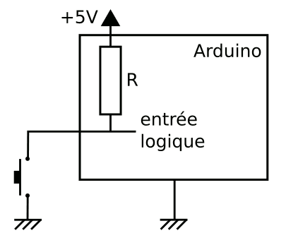

```arduino
const int numero_de_broche = 4;

void setup() {
    Serial.begin(9600);
    pinMode(numero_de_broche, INPUT_PULLUP);
}

void loop() {
    if (digitalRead(numero_de_broche) == LOW) {
        Serial.println("Le bouton est pressé");
    } else {
        Serial.println("Le bouton est relâché");
    }
    delay(1000);
}
```

--

### LED

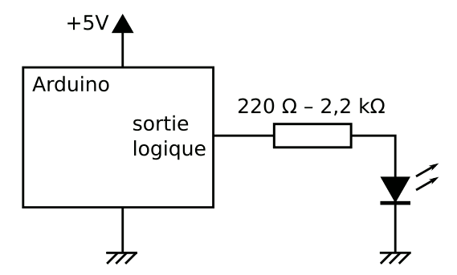

```arduino
const int numero_de_broche = 8;  // LED externe

void setup() {
    pinMode(numero_de_broche, OUTPUT);
}

void loop() {
    digitalWrite(numero_de_broche, HIGH);   // allume la LED
    delay(1000);
    digitalWrite(numero_de_broche, LOW);    // éteint la LED
    delay(1000);
}
```

Note: Aussi PWM.

--

### Moteur, relais...

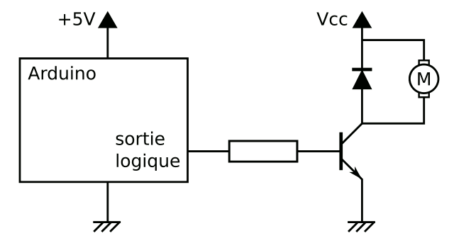

```arduino
const int numero_de_broche = 8;  // commande du moteur

void setup() {
    pinMode(numero_de_broche, OUTPUT);
}

void loop() {
    digitalWrite(numero_de_broche, HIGH);   // moteur allumé
    delay(1000);
    digitalWrite(numero_de_broche, LOW);    // moteur éteint
    delay(1000);
}
```

Note: et électrovanne, actionneur linéaire...

Potentiellement Vcc ≠ +5V, masse commune.

Aussi PWM, MOSFET, pont en H.

--

### Servo de modélisme

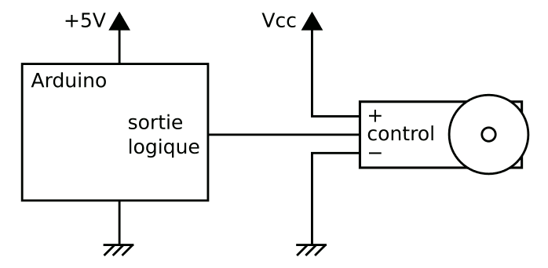

```arduino
#include <Servo.h>

const int numero_de_broche = 12;
Servo servo;

void setup() {
    servo.attach(numero_de_broche);
}

void loop() {
    servo.write(0);    // positions extrêmes : 0°...
    delay(1000);
    servo.write(180);  // ...et 180°
    delay(1000);
}
```

Note: Vcc peut être +5V si **petit** servo.

Voir exemples fournis avec l'IDE Arduino.

---

## Exercices

1 entrée et 1 sortie

---

## Programmation non bloquante

---

## Blink without Delay

Fichier → Exemples → 02.Digital → BlinkWithoutDelay

```arduino
int etat_LED = LOW;

unsigned long temps_dernier_changement = 0;  // quand a-t-on changé d'état pour la dernière fois ?

void setup() {
  pinMode(13, OUTPUT);
}

void loop() {
  unsigned long maintenant = millis();  // l'heure actuelle

  if (maintenant - temps_dernier_changement >= 400) {  // il est temps de changer d'état
    temps_dernier_changement = maintenant;

    if (etat_LED == LOW) {  // calculer le nouvel état
      etat_LED = HIGH;
    } else {
      etat_LED = LOW;
    }

    digitalWrite(13, etat_LED);  // appliquer cet état
  }
}
```

---

## Automates finis

<div style="float: right">

</div>

Ma montre

d'après le mode d'emploi

--

La même montre,  
d'après mes essais.


Note: Les ingénieurs qui l'ont conçue on probablement dessiné un schéma
semblable à celui-ci.

---

## Exercice : feu tricolore


Note: Comment ajouter un bouton d'appel piétons ?

--


Note: Problème : et si un gamin facétieux appuie sur le bouton à chaque
fois que le feu passe au vert ?

--


Note: Problème : si un piéton appelle dans l'état VERT, l'appel n'est
pas pris en compte.

--


